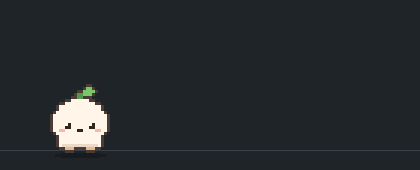

# Pixel Pal

VS Code のエクスプローラーに、好きなドット絵ペットを住まわせる拡張機能です。



- **好きなペットにできる**: ペットは「1フォルダ＝1体」。フォルダを選ぶだけで差し替わります。
- **AI で作れる**: ペット作成用のスキルを同梱。お使いの AI に頼めば、オリジナルのペットができます。
- **エディタに反応する**: 保存、エラー、ビルドやテストの成否、離席に合わせて演技をします。
- **レア演出がある**: めったに出ないシークレット演出を、ペットごとに仕込めます。

## はじめかた

1. エクスプローラーを開き、下部の「Pixel Pal」を展開します。サンプルペットの「もち」が現れます。
2. 遊んでみます。
   - パネルをクリックすると、その位置まで歩いてきます。
   - ペットをクリックすると反応します。
   - ペットを2秒以内に5回クリックすると、シークレット演出が出ます。

ビューのタイトルをドラッグすると、下部パネルやセカンダリサイドバーにも移せます。

## ペットを変える

コマンドパレットで **「Pixel Pal: ペットを選ぶ」** を実行します。次の場所にあるペットが一覧に出ます。

- 同梱のペット
- `~/.pixel-pal/pets/` に置いた自作のペット
- `~/.codex/pets/` にある Codex アプリのカスタムペット

一覧に無いフォルダも「フォルダを選択…」で指定できます。

## AI でペットを作る

### 準備

初回に出る確認で「導入する」を選びます。あとから **「Pixel Pal: ペット作成スキルをAIツールに導入」** でも導入できます。

| ツール | 準備 |
|------|------|
| GitHub Copilot（VS Code） | 不要。拡張機能を入れるだけで使えます |
| Claude Code / Cursor / Codex | 上の導入が必要です。`~/.claude/skills/` と `~/.agents/skills/` にスキルを配置します |

導入先はホームフォルダか、開いているワークスペースかを選べます。配置するのはスキルのファイルだけです。
スキルの実行には Node.js（v22 以降）が必要です。

### 頼み方

AI エージェントに、作りたいペットを伝えます。素材は `~/.pixel-pal/pets/<名前>/` に作られ、「ペットを選ぶ」の一覧に出ます。

> Pixel Pal のペットを作って。
> 丸っこい柴犬。茶色で、しっぽがくるんと巻いている。のんびりした性格。
> - 演技: 骨をかじる、あくびをする、しっぽを追いかけて回る
> - テストが通ったら、しっぽを振って喜ぶ
> - エラーが出たら、耳を伏せてしょんぼりする
> - 5分さわらなかったら、丸くなって寝る
> - シークレット: スケボーに乗って端まで走り抜ける

### うまく作ってもらうコツ

**見た目は、決め手になる特徴を3つほど伝える。**
輪郭、色、耳やしっぽなど目立つ部位が効きます。「かわいく」より「頭が大きくて目が離れている」のほうが伝わります。参考画像があれば渡してください。

**アニメーションは、種類ごとに欲しいものを挙げる。**

| 種類 | 伝えること | 例 |
|------|------|------|
| 演技 | そのキャラクターらしい日常の行動を3〜5個 | 好物を食べる、伸びをする、道具をいじる |
| リアクション | 「何が起きたら、どう反応するか」 | 保存したらうなずく、失敗したら頭を抱える |
| シークレット | 驚きのある特別な演出を1〜3個 | 乗り物に乗る、変身する、宝物を見つける |

**リアクションは、きっかけと組にして伝える。**
使えるきっかけは、クリック、保存、エラー発生、エラー解消、成功、失敗、タスク開始、デバッグの開始と終了、入力中、離席、復帰です。

**動きは「始まり、山場、終わり」で伝える。**
「カエルを食べる」より「カエルを見つけて驚き、捕まえて食べ、満足そうに笑う」のほうが、物語のある演技になります。

**一度で決めようとしない。**
まず見た目だけ作ってもらい、気に入ってから動きを足すと失敗しません。直すときは、どこがどう違うかを具体的に伝えます。

> 耳をもっと太くして。眉は目のすぐ上に。色はもう少しくすんだ緑で。

素材を作り直すと、ビューには自動で反映されます。特定の動きを見たいときは **「Pixel Pal: アニメーションを再生（確認用）」** が便利です。

既存の作品のキャラクターを題材にした素材は、個人で楽しむ範囲にとどめてください。

## ペットのフォルダ

AI に任せず、自分で用意することもできます。フォルダに `manifest.json` と、アニメーションごとの PNG を置きます。
PNG は、同じ大きさのコマを横一列に並べたものです。絵は右向きで描きます。

```json
{
  "name": "My Pet",
  "frameWidth": 48,
  "frameHeight": 48,
  "animations": {
    "idle":   { "file": "idle.png",   "kind": "idle",     "frames": 4, "delays": [1600, 120, 900, 120] },
    "walk":   { "file": "walk.png",   "kind": "walk",     "frames": 6, "delay": 120 },
    "eat":    { "file": "eat.png",    "kind": "action",   "frames": 8, "delay": 200 },
    "cheer":  { "file": "cheer.png",  "kind": "reaction", "frames": 5, "delay": 150, "on": ["success"] },
    "rocket": { "file": "rocket.png", "kind": "secret",   "frames": 4, "delay": 150, "travel": true, "chance": 0.02 }
  }
}
```

### アニメーションの種類（`kind`）

| 種類 | いつ再生されるか |
|------|------|
| `idle` | 立ち止まっている間。必須 |
| `walk` | 歩いている間。必須 |
| `walk-left` | 左へ歩く間。省略すると `walk` を左右反転 |
| `action` | 待機の合間に、ランダムで |
| `reaction` | `on` に書いたきっかけでだけ |
| `secret` | ごくまれに。ペットの5回クリックでも |

アニメーションの数に上限はありません。

### アニメーションの項目

| 項目 | 内容 | 省略時 |
|------|------|------|
| `file` | スプライトシートのファイル名 | 必須 |
| `frames` | コマ数 | 必須 |
| `delays` / `delay` | 表示時間（ミリ秒）。コマごとの配列か、全コマ共通の値 | 150 |
| `repeat` | 何回繰り返してから待機に戻るか | 1 |
| `on` | 再生するきっかけの配列 | なし |
| `onChance` | きっかけが起きたときに再生する確率 | 1 |
| `chance` | `secret` が出る確率 | 0.03 |
| `travel` | `true` なら、その絵のまま画面の端まで移動。乗り物向け | `false` |
| `speed` | `travel` のときの速さの倍率 | 1 |

### きっかけ（`on`）

| 値 | 起きるとき |
|------|------|
| `click` | ペットをクリックした |
| `save` | ファイルを保存した |
| `error` / `errorsCleared` | エラーが増えた / ゼロになった |
| `success` / `fail` | タスクやビルド・テスト系のコマンドが成功 / 失敗した |
| `taskStart` | タスクが始まった |
| `debugStart` / `debugEnd` | デバッグが始まった / 終わった |
| `typing` | しばらく入力が続いている |
| `away` / `back` | しばらく操作が無い / 操作が戻った |

ペット全体の設定（表示幅、余白、浮遊）など、すべての項目は[形式リファレンス](skills/pixel-pet-creator/references/format.md)にあります。

### Codex のペット

Codex アプリのカスタムペット（`pet.json` とアトラス画像）は、そのまま読み込めます。
同じフォルダに `manifest.json` を置くと、演技やシークレット演出を追加できます。

## コマンド

| コマンド | 内容 |
|------|------|
| Pixel Pal: ペットを選ぶ | 表示するペットを選ぶ |
| Pixel Pal: アニメーションを再生（確認用） | 指定したアニメーションをその場で再生する |
| Pixel Pal: ペットを読み込み直す | 素材を読み込み直す |
| Pixel Pal: ペット作成スキルをAIツールに導入 | スキルを AI ツール用のフォルダに配置する |

## 設定

| 設定 | 既定値 | 内容 |
|------|------|------|
| `pixelPal.petPath` | 空（同梱の `mochi`） | 表示するペットのフォルダ |
| `pixelPal.scale` | `1` | 表示倍率 |
| `pixelPal.reactToEditor` | `true` | エディタ上の出来事に反応するか |
| `pixelPal.awayMinutes` | `5` | 操作が無い状態が何分続いたら「離席」とみなすか |

## 知っておくこと

- ペットが見えるのは、ビューを表示している間だけです。
- ターミナルのコマンドへの反応には、VS Code のシェル統合が必要です。
- 通信や情報の収集は行いません。
- 拡張機能がホームフォルダに書き込むのは、スキルの導入を選んだときだけです。
